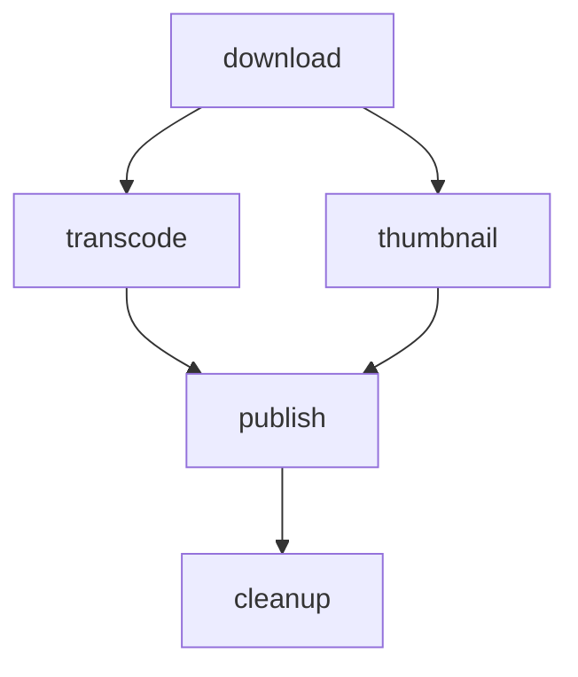
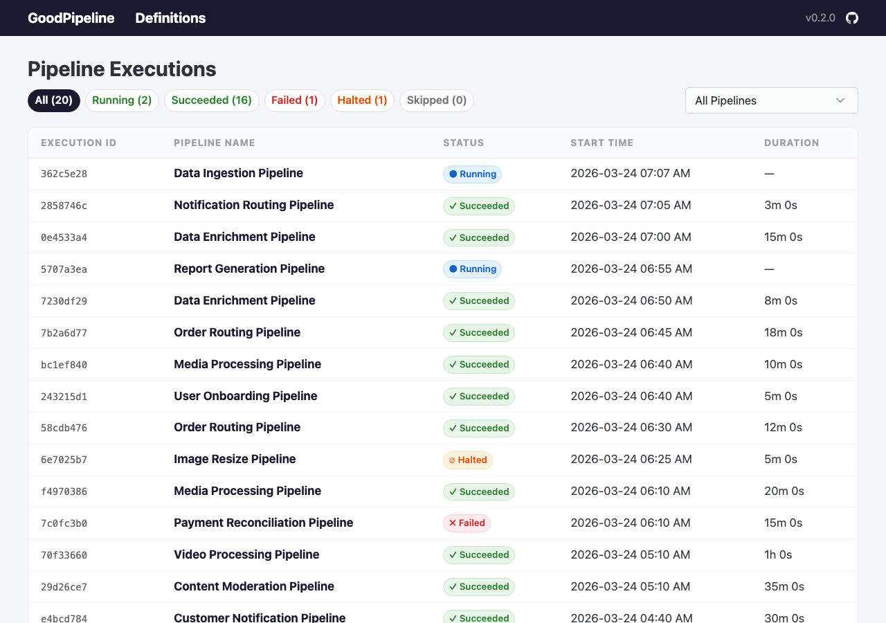
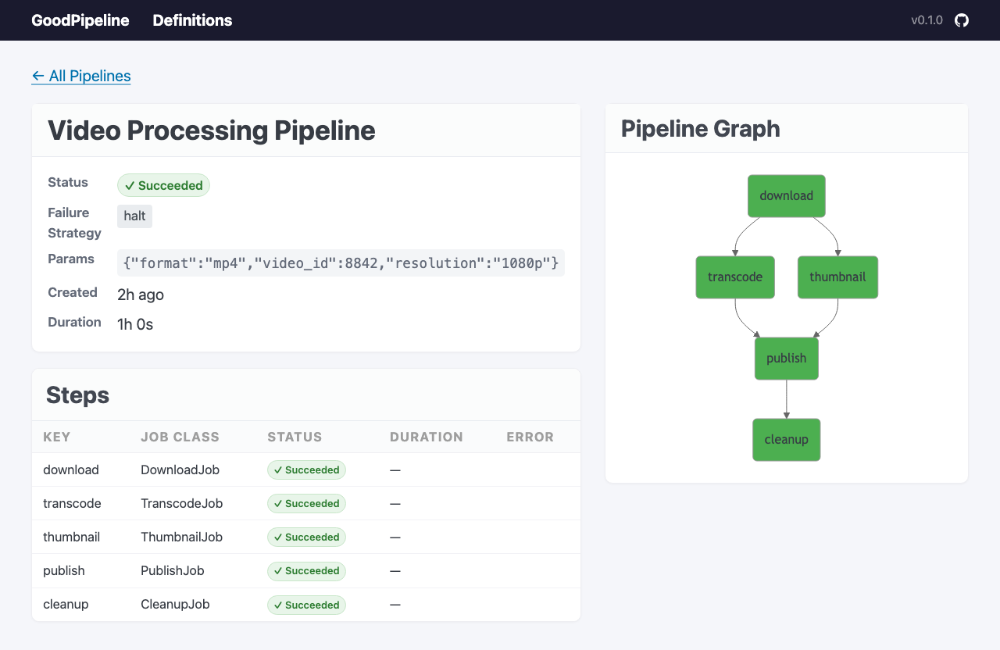
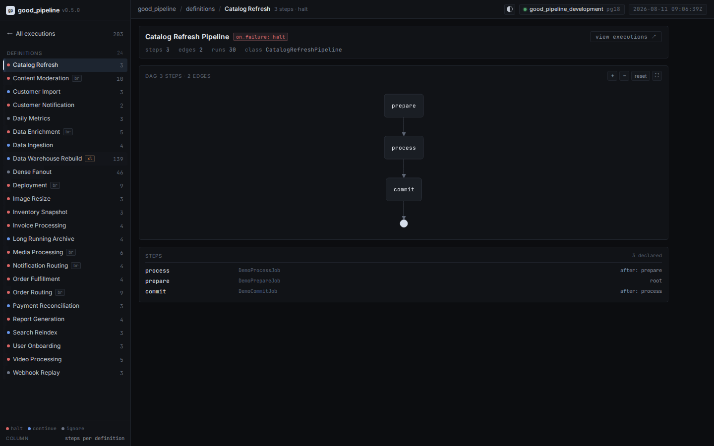

# GoodPipeline

DAG-based job pipeline orchestration for Rails, built on [GoodJob](https://github.com/bensheldon/good_job).

Define multi-step workflows as directed acyclic graphs, where each step is a GoodJob job. GoodPipeline handles dependency resolution, parallel execution, failure strategies, pipeline chaining, lifecycle callbacks, and provides a built-in web dashboard.

## Requirements

- Ruby >= 3.2
- Rails >= 7.1
- PostgreSQL
- GoodJob >= 3.10 with `preserve_job_records = true`

## Installation

Add to your Gemfile:

```ruby
gem "good_pipeline"
```

Then install the migrations:

```bash
bin/rails generate good_pipeline:install
bin/rails db:migrate
```

GoodPipeline requires GoodJob to preserve job records. Add this to your GoodJob configuration:

```ruby
# config/initializers/good_job.rb
GoodJob.preserve_job_records = true
```

GoodPipeline will raise `GoodPipeline::ConfigurationError` at boot if this is not set.

## Usage

### Defining a pipeline

Subclass `GoodPipeline::Pipeline` and implement `configure`. Use `run` to declare steps and `after:` to express dependencies:

```ruby
class VideoProcessingPipeline < GoodPipeline::Pipeline
  description "Downloads, transcodes and publishes a video"
  failure_strategy :halt

  on_complete :notify
  on_success :celebrate
  on_failure :alert

  def configure(video_id:)
    run :download,  DownloadJob,  with: { video_id: video_id }
    run :transcode, TranscodeJob, after: :download
    run :thumbnail, ThumbnailJob, after: :download
    run :publish,   PublishJob,   after: %i[transcode thumbnail]
    run :cleanup,   CleanupJob,   after: :publish
  end

  private

  def notify = Rails.logger.info("Pipeline complete")
  def celebrate = Rails.logger.info("All steps succeeded!")
  def alert = Rails.logger.warn("Pipeline had failures")
end
```

This produces the following DAG:



### Running a pipeline

```ruby
VideoProcessingPipeline.run(video_id: 123)
```

### Step options

```ruby
run :step_key, JobClass,
  with:       { key: "value" },                # keyword args passed to the job
  after:      :other_step,                     # dependency (symbol or array of symbols)
  on_failure: :ignore,                         # step-level failure strategy override
  enqueue:    { queue: :media, priority: 10 }  # options passed to job.enqueue()
```

### Failure strategies

Set at the pipeline level with `failure_strategy`:

| Strategy | Behaviour |
|---|---|
| `:halt` (default) | Stop all pending steps when any step fails |
| `:continue` | Let independent branches continue; skip only blocked downstream steps |
| `:ignore` | Treat failures as successes for dependency resolution |

Per-step overrides via `on_failure:` in `run` apply to that step's outgoing edges only.

### Pipeline chaining

Chain pipelines together with `.then()`:

```ruby
# Serial chain
VideoProcessingPipeline
  .run(video_id: 123)
  .then(NotificationPipeline, with: { video_id: 123 })

# Fan-out
VideoProcessingPipeline
  .run(video_id: 123)
  .then(
    [NotificationPipeline, with: { video_id: 123 }],
    [AnalyticsPipeline,    with: { video_id: 123 }]
  )

# Parallel start with fan-in
GoodPipeline.run(
  [VideoProcessingPipeline, with: { video_id: 123 }],
  [AudioProcessingPipeline, with: { audio_id: 456 }]
).then(MergeMediaPipeline, with: { video_id: 123, audio_id: 456 })
```

If an upstream pipeline fails or halts, downstream pipelines are automatically skipped.

### Monitoring

```ruby
pipeline = VideoProcessingPipeline.run(video_id: 123)

pipeline.status     # => "running"
pipeline.terminal?  # => false
pipeline.steps      # => all step records
pipeline.params     # => { "video_id" => 123 }

# Query across pipelines
GoodPipeline::PipelineRecord.where(status: "failed")
GoodPipeline::PipelineRecord.where(type: "VideoProcessingPipeline")
```

### Lifecycle callbacks

```ruby
class MyPipeline < GoodPipeline::Pipeline
  on_complete :always_runs    # any terminal state
  on_success  :only_success   # pipeline succeeded
  on_failure  :only_failure   # pipeline failed or halted
end
```

Callbacks are dispatched asynchronously via a separate GoodJob job. They never block the coordinator or affect pipeline state.

## Dashboard

GoodPipeline includes a mountable web dashboard for inspecting pipeline executions:

```ruby
# config/routes.rb
mount GoodPipeline::Engine => "/good_pipeline"
```

The dashboard provides:

- Pipeline Executions: filterable list with status tabs and pipeline type dropdown
- Pipeline Details: steps table, DAG visualization, chain links, error info
- Pipeline Definitions: catalog of all pipeline types with their DAG structure

### Pipeline Executions



### Pipeline Details



### Pipeline Definitions



No build step required. Uses Pico CSS and Mermaid.js from CDN.

## Cleanup

GoodPipeline automatically cleans up old terminal pipelines when GoodJob runs its own cleanup cycle. No configuration needed, it uses GoodJob's retention period (default 14 days).

To configure the retention period, set GoodJob's option:

```ruby
# config/application.rb
config.good_job.cleanup_preserved_jobs_before_seconds_ago = 30.days.to_i
```

## Development

```bash
bin/setup
mise docker:start  # PostgreSQL
rake test
```

## Contributing

Bug reports and pull requests are welcome on GitHub at https://github.com/milkstrawai/good_pipeline.

## License

The gem is available as open source under the terms of the [MIT License](https://opensource.org/licenses/MIT).
