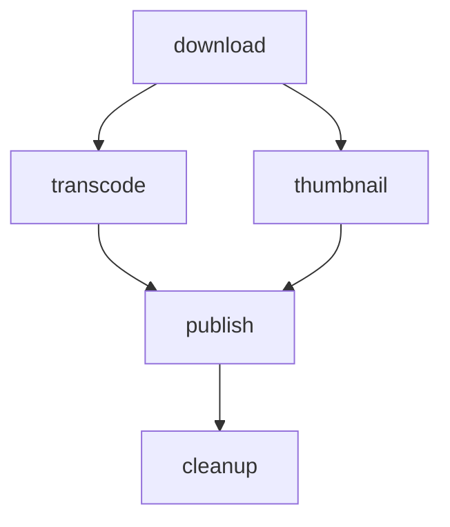

# GoodPipeline

DAG-based job pipeline orchestration for Rails, built on [GoodJob](https://github.com/bensheldon/good_job).

Define multi-step workflows as directed acyclic graphs — not linear chains. Steps run in parallel when they can and wait for dependencies when they must. GoodPipeline handles dependency resolution, parallel execution, failure strategies, conditional branching, pipeline chaining, and lifecycle callbacks. It also ships with a web dashboard.

## Requirements

- Ruby >= 3.2
- Rails >= 7.2
- PostgreSQL
- GoodJob >= 4.14 with `preserve_job_records = true`, running in a DB-mediated execution mode: `:external`, or an effectively in-process async variant (`:async`, `:async_all`, `:async_server`) with `poll_interval > 0`. LISTEN/NOTIFY is useful but cannot recover GoodJob's pre-commit local-wakeup miss on its own. `:inline` and effective deferred enqueue are rejected; for tests, use `:external` and drain with `GoodJob.perform_inline`

## Installation

Add to your Gemfile:

```ruby
gem "good_pipeline"
```

Then install the migrations:

```bash
bin/rails generate good_pipeline:install
bin/rails db:migrate
```

When upgrading an existing application to GoodPipeline 0.5, add the dashboard indexes and the cancellation column:

```bash
bin/rails generate good_pipeline:upgrade
bin/rails db:migrate
```

The upgrade generator is idempotent: each migration it owns is skipped, with a no-op status, when a file for it already exists.

GoodPipeline requires GoodJob to preserve job records. Add this to your GoodJob configuration:

```ruby
# config/initializers/good_job.rb
GoodJob.preserve_job_records = true
```

GoodPipeline will raise `GoodPipeline::ConfigurationError` at boot if this is not set.

If GoodJob executes asynchronously in the Rails process, enable positive polling even when LISTEN/NOTIFY is enabled:

```ruby
config.good_job.execution_mode = :async
config.good_job.poll_interval = 10
```

## Usage

### Defining a pipeline

Subclass `GoodPipeline::Pipeline` and implement `configure`. Use `run` to declare steps and `after:` to express dependencies:

```ruby
class VideoProcessingPipeline < GoodPipeline::Pipeline
  description "Downloads, transcodes and publishes a video"
  failure_strategy :halt

  on_complete :notify
  on_success :celebrate
  on_failure :alert

  def configure(video_id:)
    run :download,  DownloadJob,  with: { video_id: video_id }
    run :transcode, TranscodeJob, after: :download
    run :thumbnail, ThumbnailJob, after: :download
    run :publish,   PublishJob,   after: %i[transcode thumbnail]
    run :cleanup,   CleanupJob,   after: :publish
  end

  private

  def notify = Rails.logger.info("Pipeline complete")
  def celebrate = Rails.logger.info("All steps succeeded!")
  def alert = Rails.logger.warn("Pipeline had failures")
end
```

This produces the following DAG:



### Running a pipeline

```ruby
VideoProcessingPipeline.run(video_id: 123)
```

### Step options

```ruby
run :step_key, JobClass,
  with:       { key: "value" },                # keyword args passed to the job
  after:      :other_step,                     # dependency (symbol or array of symbols)
  on_failure: :ignore,                         # step-level failure strategy override
  enqueue:    { queue: :media, priority: 10 }  # options passed to job.enqueue()
```

### Failure strategies

Set at the pipeline level with `failure_strategy`:

| Strategy | Behaviour |
|---|---|
| `:halt` (default) | Stop all pending steps when any step fails |
| `:continue` | Let independent branches continue; skip only blocked downstream steps |
| `:ignore` | Treat failures as successes for dependency resolution |

Per-step overrides via `on_failure:` in `run` apply to that step's outgoing edges only.

### Conditional branching

Use `branch` to take different paths at runtime based on application state:

```ruby
class MediaPipeline < GoodPipeline::Pipeline
  def configure(media_id:)
    run :analyze, AnalyzeJob, with: { media_id: media_id }

    branch :format_check, after: :analyze, by: :detect_format do
      on :hd do
        run :transcode_hd, TranscodeHDJob, with: { media_id: media_id }
        run :upscale, UpscaleJob, with: { media_id: media_id }, after: :transcode_hd
      end

      on :sd do
        run :transcode_sd, TranscodeSDJob, with: { media_id: media_id }
      end
    end

    run :publish, PublishJob, after: :format_check
  end

  private

  def detect_format
    Media.find(params[:media_id]).hd? ? :hd : :sd
  end
end
```

The `by:` method is evaluated at runtime when the branch step is reached. The matching arm runs; other arms are skipped. `after: :format_check` waits for whichever arm was chosen to complete.

Arms can also be empty for an if-without-else pattern:

```ruby
branch :quality_check, after: :analyze, by: :needs_processing do
  on :yes do
    run :process, ProcessJob
  end
  on :no  # skip — pipeline continues to next step
end
```

The dashboard renders branches as diamond decision nodes with labeled edges.

### Pipeline chaining

Chain pipelines together with `.then()`:

```ruby
# Serial chain
VideoProcessingPipeline
  .run(video_id: 123)
  .then(NotificationPipeline, with: { video_id: 123 })

# Fan-out
VideoProcessingPipeline
  .run(video_id: 123)
  .then(
    [NotificationPipeline, with: { video_id: 123 }],
    [AnalyticsPipeline,    with: { video_id: 123 }]
  )

# Parallel start with fan-in
GoodPipeline.run(
  [VideoProcessingPipeline, with: { video_id: 123 }],
  [AudioProcessingPipeline, with: { audio_id: 456 }]
).then(MergeMediaPipeline, with: { video_id: 123, audio_id: 456 })
```

If an upstream pipeline fails or halts, downstream pipelines are automatically skipped. Each committed chain edge is propagated by a durable, retryable GoodJob job. Settlement commits the terminal status and those propagation jobs together; duplicate deliveries are harmless because the downstream transition is guarded under a row lock.

### Monitoring

```ruby
pipeline = VideoProcessingPipeline.run(video_id: 123)

pipeline.status     # => "running"
pipeline.terminal?  # => false
pipeline.steps      # => all step records
pipeline.params     # => { "video_id" => 123 }

# Query across pipelines
GoodPipeline::PipelineRecord.where(status: "failed")
GoodPipeline::PipelineRecord.where(type: "VideoProcessingPipeline")
```

### Lifecycle callbacks

```ruby
class MyPipeline < GoodPipeline::Pipeline
  on_complete :always_runs    # any terminal state
  on_success  :only_success   # pipeline succeeded
  on_failure  :only_failure   # pipeline failed or halted
end
```

Callbacks are dispatched asynchronously via a separate GoodJob job. They never block the coordinator or affect pipeline state.

## Dashboard

GoodPipeline includes a mountable web dashboard for inspecting pipeline executions:

```ruby
# config/routes.rb
mount GoodPipeline::Engine => "/good_pipeline"
```

The dashboard provides:

- Pipeline executions with composable type, status, time, and text filters, offset pagination, live status counts, and expandable step timelines
- Operational KPIs for the selected pipeline type, including current activity, fixed-window failure and duration statistics, and a 14-day sparkline
- Pipeline details with GoodJob links, step errors, chain links, a stage timeline, and an interactive DAG
- A definition catalog with declared dependencies and structural DAG or stage views
- Execution actions from both the detail page and the expanded row: re-run (always) and cancel (running executions)

Re-running starts a new execution from the same type and parameters, rebuilding the DAG from the current class definition and re-running every step; the original stays in place as history, and pipelines chained onto it with `.then` are not recreated. If graph construction fails, no new execution is created. If startup fails after persistence, the dashboard redirects to the new execution so its enqueued, failed, and skipped steps remain visible. Cancelling drains rather than kills — pending steps are skipped, steps already handed to a GoodJob worker finish, and the execution settles on `halted` once they do. See [the dashboard guide](docs/dashboard.md) for the full semantics.

Dark is the default theme in 0.5. The topbar toggle persists a light or dark preference in a permanent same-site cookie. Dashboard styles and JavaScript ship with the gem; Mermaid and web fonts are loaded from their CDNs, so there is no application-side asset build step.

Large executions remain readable: rows with more than 12 steps use an aggregate status bar, and DAGs with more than 60 steps initially show a stage view. A full graph remains available up to Mermaid's 1,000-edge safety limit. Above that limit, the stage view stays available and full rendering is disabled explicitly.

### Pipeline Executions


### Pipeline Details


### Pipeline Definitions


## Cleanup

GoodPipeline automatically cleans up old terminal pipelines when GoodJob runs its own cleanup cycle. No configuration needed, it uses GoodJob's retention period (default 14 days).

Pending and running pipelines are intentionally retained. Terminal upstreams needed by a pending chained downstream are retained too, until durable propagation resolves that relationship. GoodJob may still remove old job rows belonging to a long-running pipeline, so timing for those steps appears as `—` in the dashboard after the retention window; the pipeline and step coordination records remain available.

To configure the retention period, set GoodJob's option:

```ruby
# config/application.rb
config.good_job.cleanup_preserved_jobs_before_seconds_ago = 30.days.to_i
```

## Development

```bash
bin/setup
mise docker:start  # PostgreSQL
rake test
```

## Contributing

Bug reports and pull requests are welcome on GitHub at https://github.com/milkstrawai/good_pipeline.

## License

The gem is available as open source under the terms of the [MIT License](https://opensource.org/licenses/MIT).
